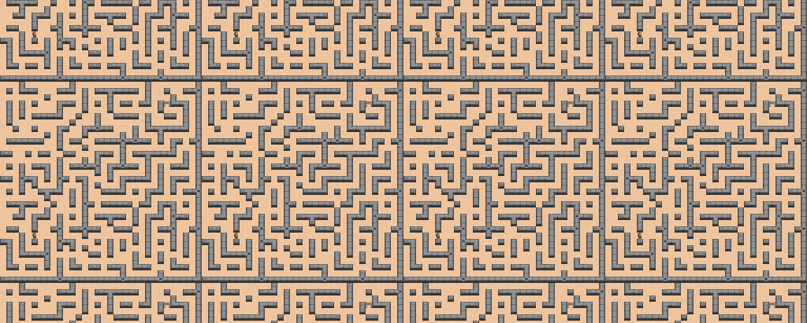

<h1 align="center">Hi 👋, I'm Roger!</h1>
<h3 align="center">PhD Student in AI at Université de Montréal and Mila Quebec AI Institute</h3>
<h4 align="center">Supervised by Professors Pablo Samuel Castro and Glen Berseth</h4>

- 🔬 Building **general autonomous agents** with **Reinforcement Learning** and **Foundation Models**.  
- 💻 I love building **RL infrastructure** — I'm a core contributor to **CleanRL** and **RLLTE**, and have developed frameworks like **RLeXplore** and others for my papers.  
- 📂 Check out my pinned repositories for open-source projects and research code!  
- 🌐 [Personal webpage](https://roger-creus.github.io/) • 📫 **roger[dot]creus[dash]castanyer[at]mila[dot]quebec**

  

